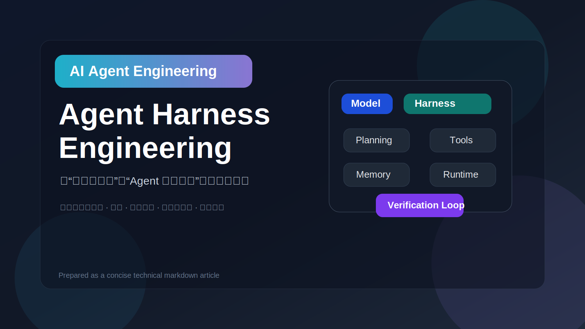
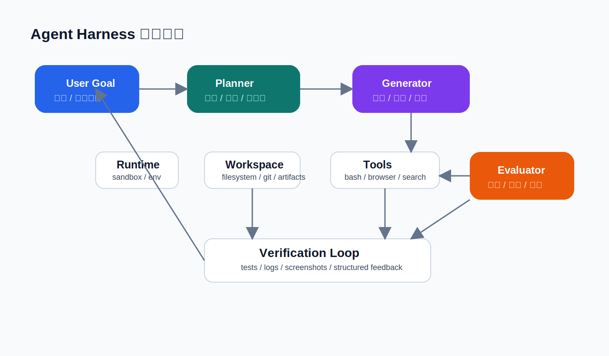
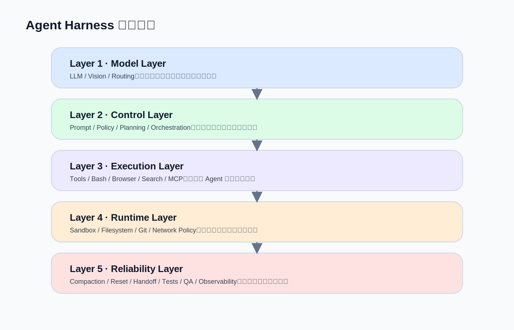

# Agent Harness Engineering

> 从“模型会思考”到“Agent 真能干活”的工程方法论

## What is Agent Harness

Agent Harness 是围绕模型构建的一整套运行支架，用来补齐 Agent 在真实任务中的关键能力。

```text
Agent = Model + Harness
```

模型负责智能，Harness 负责把智能变成生产力。

---

## Core Concepts

Agent Harness 的目标，不是让模型“回答得更像”，而是让它能够：

- 持续工作：跨步骤、跨轮次、跨会话保持状态
- 真正行动：调用工具、执行代码、操作环境、处理文件
- 稳定推进：规划、拆解、恢复、继续、交接
- 可靠交付：测试、验收、纠错、形成闭环

一个成熟的 Agent，不只是 Prompt，也不只是 Tool Calling，而是一个完整的工程系统。

---

## Harness Components

### 1. Control Layer

负责控制与编排：

- Prompt
- Policy
- Planning
- Orchestration
- Role assignment

### 2. Execution Layer

负责让 Agent 真正行动：

- Bash
- Code execution
- Browser
- Search
- API / MCP / external tools

### 3. Runtime Layer

负责提供工作环境：

- Sandbox
- Filesystem
- Git
- Dependency environment
- Permission control

### 4. State Layer

负责保存持续状态：

- Task plan
- Progress
- Intermediate artifacts
- Known issues
- Handoff notes
- Final outputs

### 5. Context Layer

负责上下文治理，而不是无上限堆上下文：

- History compression
- Tool output trimming
- State offloading
- On-demand loading

### 6. Verification Layer

负责构建可靠反馈回路：

- Unit / E2E tests
- Logs
- Screenshots
- Lint / type check
- Independent QA

---

## Core Loop



一个成熟的 Harness，通常围绕下面这条闭环运行：

1. 接收目标
2. 规划拆解
3. 执行产出
4. 收集信号
5. 独立验收
6. 反馈修复
7. 沉淀状态

关键不在“能不能完成一步”，而在于能否形成**可持续迭代的工作闭环**。

---

## Architecture View



可以把 Agent Harness 抽象为五层：

1. **Model Layer**：推理、生成、视觉理解、路由
2. **Control Layer**：Prompt、Policy、Planning、Orchestration
3. **Execution Layer**：Tools、Bash、Browser、Search
4. **Runtime Layer**：Sandbox、Filesystem、Git、Environment
5. **Reliability Layer**：Compaction、Handoff、Tests、QA、Observability

---

## Best Practices

### 1. State first, then intelligence

很多 Agent 失败，不是模型不够聪明，而是没有状态沉淀，任务无法持续推进。

### 2. Close the loop before increasing autonomy

一个不能验证、不能纠错、不能继续执行的 Agent，自治程度越高，风险越大。

### 3. Treat context as a scarce resource

不要把所有信息都塞进 context。应通过压缩、裁剪、外置状态、按需加载来控制上下文质量。

### 4. Separate execution from evaluation

执行者不适合同时充当裁判。复杂任务中，独立的 Evaluator / QA 往往能显著提升质量。

### 5. Build on artifacts, not only memory

计划、进度、问题、结果都应落到文件和 artifact 中，而不是只留在上下文里。

### 6. Start simple, then add multi-agent roles

先做好工作区、状态系统、验证闭环，再根据复杂度引入 Planner、Generator、Evaluator 等角色分工。

---

## Minimal Checklist

适合 Agent 项目最小可用 Harness 的一组检查项：

- [ ] 有独立工作区（filesystem / artifacts）
- [ ] 有执行环境（sandbox / tools / runtime）
- [ ] 有任务状态沉淀（plan / progress / handoff）
- [ ] 有上下文治理（compression / trimming / offloading）
- [ ] 有验证反馈（tests / logs / QA）
- [ ] 有失败后继续执行机制（retry / continue / repair）

---

## Summary

Agent Harness Engineering 的本质是：

> 把模型放进一个可持续工作的工程系统里。

这个系统至少要补齐五件事：

- 状态
- 工具
- 环境
- 上下文控制
- 验证反馈

在真实 Agent 产品中，模型决定上限，Harness 决定能否稳定落地。
